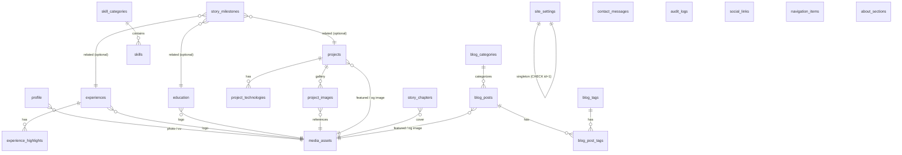

# Architecture

Database-driven portfolio with a private, single-owner CMS.

## Stack

Next.js 16 (App Router, RSC, server actions) · Drizzle ORM + Drizzle Kit → PostgreSQL on Railway (postgres.js driver) · Railway Storage Bucket via `@aws-sdk/client-s3` · Zod server-side validation · bcryptjs + HMAC-signed cookie session · Tailwind CSS 4 · Framer Motion.

## Entity-relationship diagram

Conventions: UUID primary keys (except the two singletons, which use `id = 1` with a CHECK constraint), `created_at`/`updated_at` everywhere, `published_at` on projects and posts, `content_status` enum (draft/published/archived), indexes on slugs, status, sort order, featured flags, FKs, and message status. Media FKs use `ON DELETE SET NULL`; child rows (highlights, technologies, gallery joins, post tags) use `ON DELETE CASCADE`.

## Security model

- **Login** (`/admin/login`): one owner passcode, verified with bcrypt against `ADMIN_PASSCODE_HASH` (env only, never in DB or repo). Rate limited to 5 attempts / 15 min / IP. Errors are generic.
- **Session**: stateless token `base64url(payload).HMAC-SHA256(payload)` signed with `ADMIN_SESSION_SECRET`, stored in an `HttpOnly; Secure(prod); SameSite=Lax; Path=/` cookie, 8-hour expiry. Rotating the secret invalidates all sessions instantly. Logout deletes the cookie.
- **Authorization**: the `(dashboard)` layout redirects unauthenticated visitors (UX), and **every server action and mutating route handler independently calls `requireAdmin()`** — the layout is not the security boundary.
- **CSRF**: mutations are Next.js server actions (built-in origin checking) with `SameSite=Lax` cookies; no cross-site POST can carry the session.
- **Headers**: nosniff, frame-deny, referrer-policy, permissions-policy set globally in `next.config.ts`.
- **Audit log**: every create/update/delete/publish/login/upload writes an `audit_logs` row.
- **Rate limiter**: in-memory fixed-window (single-instance deployment). If you scale to multiple instances, move it to Postgres or Redis.

## Storage flow

Upload: browser → server action (admin-only) → validate size, MIME **and** file signature (magic bytes) → collision-resistant key `portfolio/{folder}/{uuid}.{ext}` → `PutObject` to the private bucket → metadata row in `media_assets`. If the DB insert fails, the uploaded object is deleted (no orphans). Original filenames are stored as metadata but never used as keys.

Delivery: `/api/media/[id]` looks up the object key and **streams** the object through the server with long-lived cache headers. Bucket credentials never reach the browser; unknown/invalid IDs 404. Deletion refuses while any content still references the asset.

## Content flow

Public pages read published rows through `lib/content.ts` (React `cache()` for per-request dedupe) and use ISR (`revalidate = 300`). Every CMS mutation calls `revalidatePath` on the affected pages (mapped centrally in `lib/admin/revalidate.ts`), including sitemap and RSS — content changes appear without redeploys. Draft/archived content is filtered out in every public query; drafts are only viewable via the admin-gated preview page.

Blog bodies are **Markdown stored in PostgreSQL** (Option A). Trade-off: Markdown is portable, human-diffable, and reuses the existing zero-dependency sanitizing renderer (all HTML entity-escaped — script injection is neutralized). A JSONB block editor adds authoring UI complexity that a single-owner CMS doesn't need; it can be layered on later without schema changes beyond one column.

## Environment variables

| Variable | Purpose |
|---|---|
| `DATABASE_URL` | Railway PostgreSQL connection string |
| `ADMIN_PASSCODE_HASH` | bcrypt hash of the owner passcode (`npm run hash-passcode`) |
| `ADMIN_SESSION_SECRET` | 32+ char HMAC secret for session tokens |
| `RAILWAY_BUCKET_ENDPOINT` | S3-compatible endpoint (`https://t3.storageapi.dev`) |
| `RAILWAY_BUCKET_REGION` | `auto` |
| `RAILWAY_BUCKET_NAME` | bucket name |
| `RAILWAY_BUCKET_ACCESS_KEY_ID` / `RAILWAY_BUCKET_SECRET_ACCESS_KEY` | bucket credentials |
| `MAX_UPLOAD_MB` | upload size limit (default 10) |
| `RESEND_API_KEY` | optional contact-form email notifications |

## Data safety

- **Backups**: Railway PostgreSQL supports scheduled backups from the service's Backups tab; also run `pg_dump "$DATABASE_URL" > backup.sql` before risky changes. Restore with `psql "$DATABASE_URL" < backup.sql`.
- **Bucket**: objects are immutable-by-convention (new uploads get new keys); periodically sync with any S3 client (`aws s3 sync --endpoint-url ...`) for offsite copies.
- **Migrations**: generated, reviewable files in `drizzle/`; applied explicitly via `npm run db:migrate` — never destructive pushes on startup. Roll back by generating a down migration from the previous schema state and reviewing before applying.
- **Reset**: `npm run db:reset-dev` refuses to run against production (`NODE_ENV` guard + remote-host guard requiring `FORCE_RESET=1`).
- **Inspection**: use `npm run db:studio` (Drizzle Studio) or Railway's database Table View. There is deliberately no SQL console in the CMS.

## Deferred by agreement

Scheduled publishing, drag-and-drop gallery ordering (numeric sort order fields instead), post duplication, JSON content export, CAPTCHA adapter, and DB-integration tests. React Hook Form was swapped for native forms + `useActionState` with Zod on the server.
